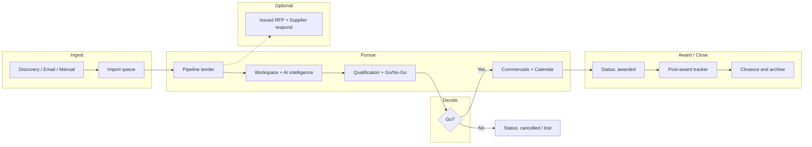

# Tender360 — End-to-End Test Plan

**Product:** Tender360 (`tm-app-code`)  
**Document type:** Master test plan (manual + automation)  
**Audience:** QA, business analysts, implementation team, MediCare / Thermo Fisher pilot users  
**Companion docs:** `TENDER360_FUNCTIONAL_USER_GUIDE.md`, `THERMO_FISHER_RTM_GAP_ANALYSIS.md`  
**Version:** 1.0  
**Created:** 2026-05-20  
**Last updated:** 2026-05-20  

---

## 1. Purpose and scope

This plan validates Tender360 from **first touch (discovery / tender creation)** through **pursuit, decision, award, closeout, and archive**. It includes:

- **Manual scenarios** — step-by-step, role-based, suitable for UAT and pilot sign-off.  
- **Automation scenarios** — API-first sequences (repeatable in Postman, Newman, or CI) plus a **UI automation** outline (Playwright/Cypress).  
- **RTM packs** — Thermo Fisher TB-001–TB-011 and ATS-001–ATS-010 where implemented.  

**In scope**

| Track | Modules |
|-------|---------|
| **Market opportunity lifecycle** | Discovery → Intelligence pipeline → Workspace → AI Docs → Qualification → Go/No-Go → Commercials → Calendar → Post-award → Closeout/archive |
| **Platform** | Auth, roles, admin, documents, evaluations API, automation console |
| **Optional parallel track** | Issued RFP (buyer) + Respond portal (supplier) |
| **Healthcare pilot** | MediCare Innovations Healthcare Pvt Ltd (`MEDICARE`) demo seeds |

**Out of scope (unless customer RTM changes)**

- TB-012/013 SharePoint/Teams upload BOT  
- TB-017–019, ATS-008 (customer out of scope)  
- Full production GovWin UI/RPA login  
- Forgot-password (UI only; not API-complete)  

---

## 2. Test environment prerequisites

### 2.1 Runtime

| Component | Requirement |
|-----------|-------------|
| MongoDB | Reachable connection string in backend `.env` |
| Backend | `cd backend && npm run dev` (port per config, typically 5000) |
| Frontend | `cd frontend && npm run dev` (Vite; `VITE_API_URL` → backend) |
| Browser | Chrome/Edge latest; one mobile viewport (375×812) for smoke |

### 2.2 Seed data (recommended)

Run from `backend/` after DB is up:

```bash
npm run seed:all
# or targeted:
npm run seed:medicare-connectors
npm run seed:sources-watchlists
npm run seed:intelligence-demo
```

**Or in-app (System Administrator):**

1. **Admin → Discovery Connectors** → **Load healthcare demo connectors**  
2. **Tender Discovery → Email Tender Scanning** → **Load demo mailboxes** → **Scan now**  
3. **AI Document Intelligence → CRM Account Intelligence** → **Load CRM demo accounts**  

### 2.3 Optional integration env vars

| Variable | Used for |
|----------|----------|
| `GOVWIN_API_KEY`, `GOVWIN_BASE_URL` | Live GovWin discovery |
| `SAM_GOV_API_KEY` | Live SAM.gov |
| `MS_GRAPH_*` | Live Outlook (ATS-001, ATS-009) |
| `SMTP_*`, `BOT_FAILURE_NOTIFY_EMAILS` | Email forward (ATS-006) and failure notify (ATS-010) |
| `SALESFORCE_*` | Live CRM validation (TB-011) |

Without live keys, **demo/cache modes** still allow full UI and API path testing.

### 2.4 Test personas

| ID | Role | Organization | Typical use |
|----|------|--------------|-------------|
| **U-ADMIN** | SYSTEM ADMINISTRATOR | Buyer (MediCare) | Seeds, discovery connectors, admin-config |
| **U-TM** | TENDER MANAGER | Buyer | Pipeline, discovery run, documents, intelligence |
| **U-REV** | REVIEWER | Buyer | Evaluation create/update |
| **U-APP** | APPROVER | Buyer | Evaluation approve, bid/no-bid |
| **U-PA** | PRICING ANALYST | Buyer | Pricing simulation |
| **U-SUP** | GUEST | Supplier | Respond portal only |

Record actual emails/passwords from your seed output; do not commit credentials to this repo.

---

## 3. End-to-end lifecycle map



**Primary happy path (market tender):**  
Discover/import → create or promote tender → intelligence & CRM validate → qualify → **Go** → price & calendar → stage **submitted** → **awarded** → post-award → **closeout/archive**.

---

## 4. Scenario ID convention

| Prefix | Type |
|--------|------|
| `TC-M-###` | Manual test case |
| `TC-A-###` | Automation test case (API or UI script) |
| `TC-RTM-TB-###` | RTM tender BOT row validation |
| `TC-RTM-ATS-###` | RTM email scanning row validation |

**Priority:** P1 = release blocker, P2 = major, P3 = minor / UI polish.

---

## 5. Master scenario index

| Phase | Manual IDs | Automation IDs | Primary route(s) |
|-------|------------|----------------|------------------|
| 0 — Access & admin | TC-M-001–010 | TC-A-001–005 | `/login`, `/admin-config/*` |
| 1 — Discovery & email | TC-M-020–045 | TC-A-020–035 | `/tender-discovery/*`, RTM pages |
| 2 — Tender creation | TC-M-050–065 | TC-A-050–058 | `/tender-intelligence/pipeline` |
| 3 — Intelligence & workspace | TC-M-070–090 | TC-A-070–078 | `/opportunity-workspace`, `/ai-document-intelligence/*` |
| 4 — Documents & AI | TC-M-100–115 | TC-A-100–108 | `/document-management/*` |
| 5 — Qualification | TC-M-120–135 | TC-A-120–128 | `/qualification-evaluation/*` |
| 6 — Go / No-Go | TC-M-140–148 | TC-A-140–144 | `/go-no-go` |
| 7 — Commercials & calendar | TC-M-150–165 | TC-A-150–155 | `/pricing-simulation/*`, `/tender-calendar/*` |
| 8 — Collaboration (optional) | TC-M-170–180 | TC-A-170–172 | `/rfp-management/*`, `/issued-rfps/*` |
| 9 — Supplier respond | TC-M-185–195 | TC-A-185–190 | `/respond/*` |
| 10 — Award & post-award | TC-M-200–215 | TC-A-200–205 | Pipeline status, `/post-award-tracker/*` |
| 11 — Closure & archive | TC-M-220–230 | TC-A-220–222 | Closeout page, tender `closed` |
| 12 — Reporting & support | TC-M-240–250 | TC-A-240–242 | `/reporting-analytics/*`, `/help-support` |

---

## 6. Phase 0 — Access, roles, and administration

### 6.1 Manual scenarios

| ID | Priority | Role | Steps | Expected result |
|----|----------|------|-------|-----------------|
| **TC-M-001** | P1 | Any | Open `/login`; enter valid buyer credentials | Redirect to `/dashboard`; sidebar visible |
| **TC-M-002** | P1 | Supplier | Login as supplier user | Redirect to `/respond/inbox`; buyer routes blocked |
| **TC-M-003** | P1 | U-ADMIN | Open **Admin** → Users; list loads | Tenant-scoped users; no cross-company data |
| **TC-M-004** | P2 | U-TM | Open `/admin-config` route as Tender Manager | Admin hub visible; individual routes may require System Administrator |
| **TC-M-005** | P1 | U-ADMIN | **Discovery Connectors** → Load healthcare demo connectors | Success toast; GovWin/SAM/email sources appear |
| **TC-M-006** | P2 | U-ADMIN | **Intelligence Platform** (admin) | Connector catalog and scoring profile seeded |
| **TC-M-007** | P2 | Any | **Profile** → update theme/notifications → Save | Persists after refresh |
| **TC-M-008** | P2 | Any | **Logout** | Session cleared; `/login` shown |
| **TC-M-009** | P3 | Mobile | Login; collapse sidebar; open Discovery on 375px width | Drawer navigation; no horizontal scroll on hub |
| **TC-M-010** | P2 | Wrong role | Non-admin opens `/admin-config/users` directly | Access denied or redirect per policy |

### 6.2 Automation scenarios

| ID | Priority | Method | Steps | Expected |
|----|----------|--------|-------|----------|
| **TC-A-001** | P1 | API | `POST /api/auth/login` with buyer creds | `200`, access token / cookie |
| **TC-A-002** | P1 | API | `GET /api/auth/profile` with auth | CompanyId, roles array |
| **TC-A-003** | P2 | API | `POST /api/discovery-connectors/seed-demo` as U-ADMIN | `200`, connector count > 0 |
| **TC-A-004** | P2 | API | `GET /api/intelligence/integrations/hub` | Connectors include discovery + email |
| **TC-A-005** | P3 | API | `POST /api/auth/login` invalid password | `401` |

---

## 7. Phase 1 — Discovery, prospecting, and email tender scanning

### 7.1 Manual — Discovery (TB-001–006)

| ID | RTM | Steps | Expected |
|----|-----|-------|----------|
| **TC-M-020** | TB-001 | **Discovery Connectors**: verify GovWin, SAM, email, manual listed; credentials masked | Active connectors for tenant |
| **TC-M-021** | TB-002 | **Scheduler**: confirm 24h lookback on a source; **Run now** on GovWin or SAM | Job completes; logs show lookback window |
| **TC-M-022** | TB-003 | **Discovery history** / **Import queue**: after job, see new/updated counts | `recordsNew` / `recordsUpdated` or changeStatus columns |
| **TC-M-023** | TB-004 | Import queue: tender with attachments | Documents linked under tender `discovery` |
| **TC-M-024** | TB-005 | SAM source job when GovWin has no files | `samFallbackUsed` or attachment count > 0 |
| **TC-M-025** | TB-006 | **Metadata** page `/tender-discovery/metadata` | Program summary / contacts where imported |
| **TC-M-026** | — | **Prospecting RTM** `/tender-discovery/prospecting` | TB-001–006 status cards reflect data |
| **TC-M-027** | — | Promote/import opportunity to pipeline (import queue action or pipeline create from discovery) | Tender appears in **Pipeline** with `discovery.externalKey` |

### 7.2 Manual — Email scanning (ATS-001–010)

| ID | RTM | Steps | Expected |
|----|-----|-------|----------|
| **TC-M-030** | ATS-001 | **Email Tender Scanning** → Load demo mailboxes | US + AT mailboxes listed |
| **TC-M-031** | ATS-001–007 | **Scan now** | Messages processed; matched/rejected/image_oos decisions |
| **TC-M-032** | ATS-004 | Open multi-link email row | Retained vs rejected link counts shown |
| **TC-M-033** | ATS-007 | No-link amendment email | `keywords_only` + matched decision |
| **TC-M-034** | ATS-008 | Image-only email | `image_oos`; not imported as tender |
| **TC-M-035** | ATS-005 | Rejected newsletter email | `rejected`; move action logged |
| **TC-M-036** | ATS-006 | Matched email | Forward action logged (SMTP or simulated) |
| **TC-M-037** | ATS-009/010 | **Simulate failure (ATS-010)** | Failure row + screenshot artifact link |
| **TC-M-038** | — | Run email **discovery job** on email TenderSource | Opportunities returned in discovery job stats |

### 7.3 Automation — Discovery & email

| ID | API sequence | Expected |
|----|--------------|----------|
| **TC-A-020** | `GET /api/intelligence/discovery/prospecting-rtm` | `requirements` length ≥ 6 |
| **TC-A-021** | `POST /api/intelligence/discovery/jobs` body `{ sourceId }` | Job `completed` or `running` |
| **TC-A-022** | `GET /api/intelligence/discovery/import-queue` | Array with batch stats |
| **TC-A-023** | `POST /api/intelligence/email-tender-scanning/seed-demo` | Mailboxes created |
| **TC-A-024** | `POST /api/intelligence/email-tender-scanning/scan` | `results[].ingested` ≥ 0 |
| **TC-A-025** | `GET /api/intelligence/email-tender-scanning/rtm` | ATS-001–010 requirements present |
| **TC-A-026** | `POST /api/intelligence/email-tender-scanning/simulate-failure-demo` | Failure with `screenshotUrl` |
| **TC-A-027** | `GET /api/intelligence/email-tender-scanning/failures` | Includes ATS-009/010 rows |

---

## 8. Phase 2 — Tender creation (manual and from discovery)

### 8.1 Manual scenarios

| ID | Priority | Steps | Expected |
|----|----------|-------|----------|
| **TC-M-050** | P1 | **Intelligence → Pipeline** → **Create tender** | Form opens (drawer/modal) |
| **TC-M-051** | P1 | Fill required fields: reference `TEST-E2E-001`, title, organization, location, description, value, deadline, type, therapeutic area, source, owner | Validation passes |
| **TC-M-052** | P1 | Save | Tender in list; status `active`; stage `identified` |
| **TC-M-053** | P2 | Duplicate reference `TEST-E2E-001` | Error: unique reference per company |
| **TC-M-054** | P2 | Edit tender: stage → `evaluating`; priority `high` | Saved; dashboard/pipeline reflect change |
| **TC-M-055** | P2 | **Create tender from document** (upload PDF in Document Management, then create-tender action if exposed) | New tender with linked document |
| **TC-M-056** | P2 | Import discovery opportunity (Phase 1) | Tender has `discovery.externalKey` and metadata |
| **TC-M-057** | P3 | Export pipeline table | File/download or CSV per UI |
| **TC-M-058** | P3 | Row **ellipsis menu**: View, Edit, Delete | Actions match role gates |

### 8.2 Automation scenarios

| ID | API | Body / notes | Expected |
|----|-----|--------------|----------|
| **TC-A-050** | `POST /api/tenders` | Minimal valid tender payload | `201`, `_id` returned |
| **TC-A-051** | `GET /api/tenders/:id` | — | Matches created fields |
| **TC-A-052** | `PUT /api/tenders/:id` | `pipelineStage: pursuing` | `200` |
| **TC-A-053** | `POST /api/tenders` | Duplicate reference | `4xx` |
| **TC-A-054** | `GET /api/tenders` | `?search=TEST-E2E` | Includes created tender |

---

## 9. Phase 3 — Intelligence, workspace, and CRM (TB-006–011)

### 9.1 Manual scenarios

| ID | RTM | Steps | Expected |
|----|-----|-------|----------|
| **TC-M-070** | TB-006–010 | **AI Docs → Tender Intelligence RTM** | KPI counts; run intelligence on a tender if button available |
| **TC-M-071** | TB-006–010 | **Opportunity Workspace** → open tender from hub | Timeline, meters, tabs load |
| **TC-M-072** | TB-007–009 | Workspace / intelligence: commercial, T&C, pricing sections after run | `tender.intelligence` populated or RTM counts > 0 |
| **TC-M-073** | TB-010 | Scoring / relevancy visible in workspace or qualification | Score recommendation present |
| **TC-M-074** | TB-011 | CRM tab → **Validate in Salesforce** | Badge validated/partial; account name |
| **TC-M-075** | TB-011 | **CRM Account Intelligence** board → seed + validate recent | Feed shows validations |
| **TC-M-076** | — | **Sources & watchlists**: create watchlist keyword `hospital` | Used by email scan (ATS-002) |
| **TC-M-077** | — | **Competitors** hub: open profiling (smoke) | Page renders without error |
| **TC-M-078** | P2 | **Automation console** (Discovery hub panel) | Jobs/failures lists load |

### 9.2 Automation scenarios

| ID | API | Expected |
|----|-----|----------|
| **TC-A-070** | `GET /api/intelligence/tender-intelligence/rtm` | 5 requirements |
| **TC-A-071** | `POST /api/intelligence/tender-intelligence/:tenderId/run` | `tender.intelligence` keys present |
| **TC-A-072** | `GET /api/intelligence/workspace/:tenderId` | `crmIntelligence`, `timeline` |
| **TC-A-073** | `POST /api/intelligence/crm-account/:tenderId/validate` | `crmValidation.status` |
| **TC-A-074** | `GET /api/intelligence/crm-account/rtm` | TB-011 requirement |
| **TC-A-075** | `POST /api/intelligence/scoring/opportunities/:tenderId/run` | OpportunityScore created |

---

## 10. Phase 4 — Document management and AI extraction

### 10.1 Manual scenarios

| ID | Priority | Steps | Expected |
|----|----------|-------|----------|
| **TC-M-100** | P1 | Upload PDF (< 50 MB) to **Content library** or tender-linked upload | Success; document listed |
| **TC-M-101** | P2 | **AI analysis** run on document | Extraction job completes or status shown |
| **TC-M-102** | P2 | **Clause viewer** / redaction rules (smoke) | Pages load |
| **TC-M-103** | P2 | **Version control**: compare versions (if two versions exist) | Diff UI shown |
| **TC-M-104** | P3 | Upload disallowed file type | Rejection message |
| **TC-M-105** | P3 | **AI Document Intelligence** hub → open RTM / CRM boards | Navigation works |

### 10.2 Automation scenarios

| ID | API | Expected |
|----|-----|----------|
| **TC-A-100** | `POST /api/documents` multipart upload | `201` |
| **TC-A-101** | `POST /api/intelligence/documents/:id/extractions` | Extraction record |
| **TC-A-102** | `GET /api/intelligence/documents/intelligence` | List includes uploaded doc |

---

## 11. Phase 5 — Qualification and evaluation

### 11.1 Manual scenarios

| ID | Priority | Steps | Expected |
|----|----------|-------|----------|
| **TC-M-120** | P1 | **Qualification** hub → **Bid/No-bid** or evaluation entry for `TEST-E2E-001` | Evaluation form available |
| **TC-M-121** | P1 | U-REV: Create evaluation type `COMPREHENSIVE`; add criteria scores; status `IN_PROGRESS` | Saved |
| **TC-M-122** | P1 | U-APP: Set decision `BID`; status `APPROVED` | Decision recorded |
| **TC-M-123** | P2 | **Compliance matrix**, **Risk exceptions** (smoke navigate) | No crash; tables render |
| **TC-M-124** | P2 | **Workspace tasks** checklist items | UI functional |
| **TC-M-125** | P2 | Evaluation `NO_BID` path on second tender | Pipeline can move to `lost` later |

### 11.2 Automation scenarios

| ID | API | Expected |
|----|-----|----------|
| **TC-A-120** | `POST /api/evaluations` with `tenderId`, criteria | `201` |
| **TC-A-121** | `PUT /api/evaluations/:id` decision `BID` | `200` |
| **TC-A-122** | `GET /api/evaluations?tenderId=` | Returns evaluation |

---

## 12. Phase 6 — Go / No-Go committee

### 12.1 Manual scenarios

| ID | Priority | Steps | Expected |
|----|----------|-------|----------|
| **TC-M-140** | P1 | **Go / No-Go** hub → open review for tender | Review card loads |
| **TC-M-141** | P1 | Record committee decision **Go** with summary | Status updated |
| **TC-M-142** | P2 | **No-Go** on alternate tender | Recommendation `decline`; align pipeline stage `lost` |
| **TC-M-143** | P2 | Workspace shows Go/No-Go in timeline after decision | Timeline node complete |

### 12.2 Automation scenarios

| ID | API | Expected |
|----|-----|----------|
| **TC-A-140** | `POST /api/intelligence/go-no-go/reviews` body `{ tenderId, status, summary }` | Review upserted |
| **TC-A-141** | `GET /api/intelligence/go-no-go/reviews` | Includes tender |

---

## 13. Phase 7 — Commercials, calendar, and collaboration (pre-submission)

### 13.1 Manual scenarios

| ID | Priority | Steps | Expected |
|----|----------|-------|----------|
| **TC-M-150** | P2 | **Pricing → Scenarios**: create scenario linked to tender (UI) | Form saves or demo row |
| **TC-M-151** | P2 | **CPQ import** page (smoke) | Loads |
| **TC-M-152** | P2 | **Calendar → Event management**: create milestone before deadline | Event on calendar |
| **TC-M-153** | P2 | **Deadline tracking** shows tender deadline | Countdown visible |
| **TC-M-154** | P3 | **RFP Management → Create RFP** (internal workflow UI) | Wizard/pages load |
| **TC-M-155** | P2 | Pipeline stage → `pursuing` then `submitted` | Stage persisted |

### 13.2 Automation scenarios

| ID | API | Expected |
|----|-----|----------|
| **TC-A-150** | `POST /api/calendar/events` with `tenderId` | `201` |
| **TC-A-151** | `GET /api/calendar/events` | Event listed |
| **TC-A-152** | `PUT /api/tenders/:id` `pipelineStage: submitted` | `200` |

---

## 14. Phase 8 — Issued RFP and supplier respond (optional parallel track)

### 14.1 Manual scenarios

| ID | Priority | Steps | Expected |
|----|----------|-------|----------|
| **TC-M-170** | P1 | **Issued RFPs → New** → title, deadline, terms → Save | Status `draft` |
| **TC-M-171** | P1 | **Publish** draft | Status `published` |
| **TC-M-172** | P1 | **Invite** supplier email | Invitation created; dev redeem link shown |
| **TC-M-173** | P1 | U-SUP: Open redeem link → accept terms → **Submit** proposal | Submission `submitted` |
| **TC-M-174** | P2 | Issuer views submissions table | Supplier row visible |
| **TC-M-175** | P2 | **Close** issued RFP | Status `closed` |

### 14.2 Automation scenarios

| ID | API | Expected |
|----|-----|----------|
| **TC-A-170** | `POST /api/issued-rfps` | `draft` RFP |
| **TC-A-171** | `POST /api/issued-rfps/:id/publish` | `published` |
| **TC-A-172** | `POST /api/issued-rfps/:id/invitations` | Invitation token |
| **TC-A-185** | Supplier `POST /api/respond/...` submit | `submitted` |

---

## 15. Phase 9 — Award, post-award, closure, and archive

### 15.1 Manual scenarios

| ID | Priority | Steps | Expected |
|----|----------|-------|----------|
| **TC-M-200** | P1 | Pipeline: set tender status **`awarded`**, stage **`awarded`** | Saved; dashboard KPIs update |
| **TC-M-201** | P2 | **Post-award → SLAs & KPIs** (smoke) | Hub loads |
| **TC-M-202** | P2 | **Milestones & billing** (smoke) | Page loads |
| **TC-M-203** | P1 | **Closeout & archive** `/post-award-tracker/closeout-archive` | Project list shown |
| **TC-M-204** | P1 | Select in-progress project → **Archive** confirm | Status `Archived`; archived date set |
| **TC-M-205** | P1 | Pipeline: set same tender status **`closed`** (or `cancelled` if no-bid path) | No further edits per status rules in UI |
| **TC-M-206** | P2 | **Tender modal**: verify `closed` restricts edit | Warning or read-only |
| **TC-M-207** | P2 | **Delete** tender (soft delete) as U-TM | `isDeleted`; removed from default pipeline list |
| **TC-M-208** | P3 | **Reporting → Custom report builder** (smoke) | Page loads |
| **TC-M-209** | P3 | **Help & Support** → create ticket | Ticket in list |

### 15.2 Automation scenarios

| ID | API | Expected |
|----|-----|----------|
| **TC-A-200** | `PUT /api/tenders/:id` `{ status: awarded, pipelineStage: awarded }` | `200` |
| **TC-A-201** | `PUT /api/tenders/:id` `{ status: closed }` | `200` |
| **TC-A-220** | `DELETE /api/tenders/:id` or soft-delete endpoint | Tender not in `GET` list |

---

## 16. Full end-to-end manual script (single narrative)

**Duration estimate:** 4–6 hours (with demo seeds); 1–2 days with live connectors.

| Step | Action | Role | Checkpoint |
|------|--------|------|------------|
| 1 | Login | U-ADMIN | Dashboard |
| 2 | Seed connectors + email + CRM | U-ADMIN | RTM boards green/amber |
| 3 | Run discovery job (GovWin/SAM/email) | U-TM | Import queue has rows |
| 4 | Promote one opportunity to pipeline | U-TM | New tender with discovery metadata |
| 5 | Create manual tender `TEST-E2E-001` | U-TM | Pipeline list |
| 6 | Upload RFP PDF; run AI extraction | U-TM | Document + extraction |
| 7 | Run tender intelligence + CRM validate | U-TM | Workspace tabs populated |
| 8 | Complete evaluation → BID | U-REV / U-APP | Evaluation approved |
| 9 | Go / No-Go → Go | U-APP | Committee Go |
| 10 | Pricing scenario + calendar event | U-PA / U-TM | Commercials/calendar |
| 11 | Stage → submitted | U-TM | Pipeline stage |
| 12 | Status → awarded | U-TM | Awarded |
| 13 | Post-award closeout → Archive | U-TM | Archived in closeout UI |
| 14 | Status → closed | U-TM | Closed |
| 15 | Dashboard + Analytics smoke | U-TM | No errors |
| 16 | (Optional) Issued RFP + supplier submit | U-TM / U-SUP | Parallel track complete |

---

## 17. Automation architecture (implementation guide)

### 17.1 Recommended stack

| Layer | Tool | Purpose |
|-------|------|---------|
| API regression | **Postman** or **Newman** | Collection mapped to `TC-A-*` |
| API auth | Collection pre-request: login → store `accessToken` | Bearer on all `/api/*` |
| UI regression | **Playwright** (recommended) or Cypress | `TC-UI-*` mapped to `TC-M-*` subset |
| CI | GitHub Actions / Azure DevOps | Run Newman on PR; nightly Playwright smoke |

### 17.2 API collection structure (folders)

```
Tender360 E2E API
├── 00 Auth
├── 10 Admin & Seed
├── 20 Discovery & Email (RTM TB/ATS)
├── 30 Tenders CRUD
├── 40 Intelligence & CRM & Scoring
├── 50 Documents & Extractions
├── 60 Evaluations
├── 70 Go-No-Go
├── 80 Calendar
├── 90 Issued RFP & Respond
└── 99 Teardown (soft-delete test tenders)
```

### 17.3 Sample Newman-ready flow (pseudocode)

```javascript
// 1. Login
pm.test("TC-A-001", () => pm.response.code === 200);

// 2. Seed (admin token)
POST /api/discovery-connectors/seed-demo
POST /api/intelligence/email-tender-scanning/seed-demo

// 3. Create tender
const tenderId = pm.response.json().data._id;

// 4. Intelligence
POST /api/intelligence/tender-intelligence/{{tenderId}}/run
POST /api/intelligence/crm-account/{{tenderId}}/validate

// 5. Evaluation + Go
POST /api/evaluations { tenderId }
POST /api/intelligence/go-no-go/reviews { tenderId, status: "approved" }

// 6. Award & close
PUT /api/tenders/{{tenderId}} { status: "awarded" }
PUT /api/tenders/{{tenderId}} { status: "closed" }
```

### 17.4 UI automation outline (Playwright)

| Spec file | Covers |
|-----------|--------|
| `e2e/auth.spec.ts` | TC-M-001, 002, 008 |
| `e2e/discovery.spec.ts` | TC-M-020–027, 030–038 |
| `e2e/pipeline.spec.ts` | TC-M-050–058 |
| `e2e/workspace.spec.ts` | TC-M-070–075 |
| `e2e/qualification.spec.ts` | TC-M-120–125, 140–143 |
| `e2e/lifecycle-close.spec.ts` | TC-M-200–207 |

**Base URL:** `process.env.BASE_URL` (e.g. `http://localhost:5173`)  
**Storage state:** save auth after login spec; reuse for module specs.

### 17.5 RTM regression pack (customer demo)

Run before Thermo Fisher workshops:

| Pack | Cases | Pass criteria |
|------|-------|---------------|
| **TB Discovery** | TC-RTM-TB-001 … 006 = TC-M-020–027 + TC-A-020–022 | All RTM cards `active` or `ready` with data |
| **TB Intelligence** | TC-M-070–075, TC-A-070–075 | Intelligence + CRM RTM active |
| **ATS Email** | TC-M-030–037, TC-A-023–027 | ATS-001–007 active; ATS-008 `not_available` |
| **ATS Errors** | TC-M-037, TC-A-026 | ATS-009–010 artifacts visible |

---

## 18. Non-functional and security tests

| ID | Type | Steps | Expected |
|----|------|-------|----------|
| **TC-M-260** | Security | Access API without token | `401` |
| **TC-M-261** | Security | User A token on company B tender id | `403` or `404` |
| **TC-M-262** | Security | Supplier token on `/api/tenders` | Denied |
| **TC-M-263** | Performance | Pipeline list with 100+ tenders | Loads < 5 s on LAN |
| **TC-M-264** | Responsive | Full hub navigation on mobile | All buyer hubs reachable |
| **TC-M-265** | Resilience | Stop backend during discovery job | Graceful error in UI |

---

## 19. Test data cleanup

| Item | Action |
|------|--------|
| Tenders `TEST-E2E-*` | Soft-delete via UI or `DELETE /api/tenders/:id` |
| Demo email messages | Re-seed or delete `EmailTenderMessage` for company in DB |
| Automation failures | Mark `resolvedAt` in admin or DB for demo resets |
| Issued RFP test | Cancel draft test RFPs |

---

## 20. Defect logging template

| Field | Value |
|-------|-------|
| **Defect ID** | DEF-### |
| **Test case** | TC-M-### or TC-A-### |
| **Environment** | Dev / UAT / Prod |
| **Role** | U-ADMIN / U-TM / … |
| **Route** | e.g. `/tender-discovery/email-scanning` |
| **Steps to reproduce** | … |
| **Expected** | … |
| **Actual** | … |
| **Screenshot / HAR** | Attach ATS-010 artifact or browser trace |
| **Severity** | Blocker / Major / Minor |

---

## 21. Exit criteria (release readiness)

| # | Criterion | Target |
|---|-----------|--------|
| 1 | All **P1** manual cases pass | 100% |
| 2 | All **P1** API automation cases pass | 100% |
| 3 | E2E narrative (Section 16) completes without blocker | Once per release |
| 4 | RTM packs (Section 17.5) demo-ready | TB-001–006, TB-011, ATS-001–010 |
| 5 | No open Blocker defects on pursuit lifecycle | 0 |
| 6 | Mobile smoke (TC-M-009, 264) | Pass |
| 7 | Sign-off | Product owner + QA lead |

---

## 22. Traceability to gap analysis

| Gap doc section | Test pack |
|-----------------|-----------|
| TB-001–006 | Section 7, TC-M-020–027 |
| TB-007–010 | Section 9, TC-M-070–073 |
| TB-011 | Section 9, TC-M-074–075 |
| ATS-001–008 | Section 7.2 |
| ATS-009–010 | Section 7.2, TC-M-037 |
| Feature maturity §19 user guide | P3 smoke + documented stubs |

---

## 23. Document maintenance

| Date | Change |
|------|--------|
| 2026-05-20 | v1.0 — Initial E2E test plan: manual + automation + RTM packs + lifecycle through archive |

---

*Execute tests in order Section 16 for first-time UAT; use Section 5 index for regression by module. Link failures to `THERMO_FISHER_RTM_GAP_ANALYSIS.md` when validating customer RTM claims.*
