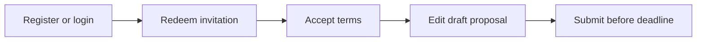

# Tender360 — Functional User Guide

**Product:** Tender360 (`tm-app-code`)  
**Document type:** End-user functional reference  
**Audience:** Buyer organization users, supplier participants, and system administrators  
**Last updated:** 2026-05-13  

This guide describes what Tender360 does, who can use each area, and how to complete day-to-day work. It is organized by business function and follows the buyer sidebar order (Dashboard → Discovery → Intelligence → Workspace → AI Docs → Qualification → Go / No-Go → Collaboration → Commercials → Calendar → Post-award → Analytics → Integrations → Governance → Admin → Help).

---

## 1. Product overview

Tender360 is a tender and RFP management platform for organizations that **pursue external market opportunities** and, where needed, **issue RFPs to invited suppliers**.

The application supports two related but distinct workflows:

| Concept | What it is | Typical user |
|--------|------------|--------------|
| **Market opportunity (Tender)** | An external tender or RFP your organization is tracking, qualifying, and deciding whether to bid on | Tender Manager, Reviewer, Approver |
| **Issued RFP** | An event **your organization publishes** for suppliers to accept terms and submit proposals | Buyer issuer users; supplier participants |

**Organization kinds**

- **Buyer** — Your company uses the main workspace (dashboard, tender intelligence, documents, and related modules).
- **Supplier** — Your company uses the **Respond** portal only (`/respond/*`) to redeem invitations and submit proposals.

All operational data is scoped to your **company (tenant)** unless access is explicitly granted through an **issued-RFP invitation**.

**Platform stack (for operators):** React web client (responsive layout, installable PWA), Express API, MongoDB. Session uses JWT access tokens with refresh-token cookies.

---

## 2. Roles, access, and navigation

### 2.1 Application roles

| Role | Primary responsibilities |
|------|-------------------------|
| **SYSTEM ADMINISTRATOR** | Platform configuration, users, roles, security, audit, system settings |
| **ADMIN** | Elevated operations on documents, evaluations, and users (varies by API route) |
| **TENDER MANAGER** | Tender pipeline, intelligence updates, document upload, user/role management (with system admin on some routes) |
| **REVIEWER** | Create and update evaluations; participate in review workflows |
| **APPROVER** | Review evaluations and record bid / no-bid decisions |
| **PRICING ANALYST** | Pricing-related endpoints and commercial workflows |
| **GUEST** | Default role for new **supplier** self-registration |

Permissions are also defined as strings on **Role** records (for example user, tender, document, evaluation, pricing, contract, report, setting, system, calendar, support scopes, or `ALL`).

### 2.2 What each role typically sees

- **Main sidebar (buyer):** Dashboard, **Discovery**, **Intelligence**, Workspace, AI Docs, Qualification, Go / No-Go, Collaboration, Commercials, Calendar, Post-award, Analytics, Integrations, Governance, Help. **Admin** appears for **SYSTEM ADMINISTRATOR** and **TENDER MANAGER**.
- **Admin child routes** under `/admin-config/*` require **SYSTEM ADMINISTRATOR** on each route, even if Admin appears in the sidebar for Tender Managers.
- **Supplier users** are redirected to `/respond/inbox` after login and cannot open buyer routes.

### 2.3 Signing in and signing out

**Buyer login**

1. Open `/login`.
2. Enter **email** and **password**.
3. On success, users with `organizationKind` **buyer** land on **Dashboard** (`/dashboard`).

**Supplier login**

1. Use the same login page.
2. On success, users with `organizationKind` **supplier** land on **Respond → Invitations** (`/respond/inbox`).

**Supplier self-registration**

1. From login, follow **Create participant account** (or open `/register-respondent`).
2. Provide: work email, password (minimum 6 characters), your name, company name, optional display name.
3. The system creates a **supplier** company and a user with role **GUEST**, signs you in, and opens the respond inbox.

**Forgot password**

- The `/forgot-password` screen is available in the UI; **password reset is not fully wired to the API** at the time of this guide. Contact your administrator if you cannot sign in.

**Sign out**

- Use **Logout** in the sidebar (buyer) or respond layout header. You are returned to the login page.

### 2.4 Layout and navigation

**Buyer shell (`MainLayout`)**

- **Hierarchical sidebar** — Collapsible on desktop; overlay drawer on mobile. Module labels are shortened on narrow viewports (for example “Intelligence”, “Post-award”, “AI Docs”).
- **Header** — Company context, global search, **My Work** shortcut, notifications, and profile menu (Profile, My Work, Logout). There is **no** “New RFP” control in the top bar; start buyer RFP work from **RFP Management** or **Issued RFPs** in the sidebar (Sections 6–7), or open `/rfp-management/create` or `/issued-rfps/new` directly if you have the link.
- **Toast notifications** — Short success/error messages (top-right).

**Respond shell (`RespondLayout`)**

- Minimal navigation: invitations inbox, redeem invitation, profile/logout. No full buyer module tree.

**Route protection**

- Unauthenticated users are sent to `/login`.
- Wrong organization kind is redirected to the correct home (buyer → dashboard, supplier → respond inbox).
- Missing required role on a protected admin route redirects to dashboard.

### 2.5 Profile and personal settings

Open **Profile** (`/profile`) from the user menu.

| Area | Fields / actions |
|------|------------------|
| Identity | Name, email (display), phone, department, position |
| Organization | Company display name (read from profile) |
| Preferences | Theme (light/dark), email notifications, push notifications |
| Security | Change-password entry points as exposed in UI |

Updates are saved through **GET/PUT `/api/auth/profile`**. Theme preference applies to the signed-in session experience.

### 2.6 Executive command centers and form drawers

Several buyer modules share a consistent **executive command center** layout:

- **Hero band** — Page title, short description, and **Refresh** with a telemetry caption.
- **Intelligence outlook** — Dark cinematic summary with status **chips**.
- **Insight stream** — Highlight cards for risks, queues, and recommended next actions.
- **Signal board** — Four premium KPI cards with animated counters, trend text, and sparklines.
- **Primary workspace card** — Tabbed tables or work queues below the KPI strip.

This pattern is used on **Discovery**, **Tender Intelligence** (Pipeline and Sources & watchlists), **My Work**, and related intelligence hubs.

**Create and edit records** across admin, intelligence, qualification, documents, pricing, post-award, and reporting screens open in a **full-height right-side form drawer** (slide-in panel). **View-only detail** dialogs (for example source/watchlist details, competitor or role summaries) remain **centered modals** where read-only review is the primary action.

**Responsive behavior:** KPI strips stack on small screens; work-queue rows and action buttons reflow to full width on mobile while keeping equal action control heights on **My Work**.

---

## 3. Dashboard

**Route:** `/dashboard`  
**Purpose:** Executive view of pipeline health, deadlines, and recent activity.

### 3.1 Key metrics (KPI cards)

Typical cards include:

- **Active tenders** — Count and trend of open pursuits.
- **Win ratio** — Historical or modeled win rate indicator.
- **Upcoming deadlines** — Submissions or milestones due soon.
- **Pipeline value** — Aggregated estimated value (display may use INR millions where configured).
- **AI match score** — Average or highlight match strength for opportunities.

Each card may show a **trend chip** (up/down) and a small **sparkline**. Use **Refresh** to reload overview, stats, and activities from the dashboard API.

### 3.2 Charts and insights

- **Pipeline / value chart** — Time-series or composed chart of opportunity value and activity.
- **Insight panels** — Themed callouts (target, risk, currency, compliance) with recommended actions.

### 3.3 Active tenders table

Columns commonly include reference, title, organization, stage, probability, AI score, urgency, priority, days left, and deadline. Row actions may open **Tender Intelligence → Pipeline** or related detail flows.

On **mobile**, the active tender list may paginate (for example five rows per page) for readability.

### 3.4 Upcoming deadlines and recent activity

- **Deadlines** — Sorted by due date; links into calendar or pipeline where configured.
- **Recent activities** — Audit-style feed of uploads, stage changes, evaluations, and system events.

**Data note:** Some dashboard trend values may be **supplemented or mocked** in the API layer; treat KPIs as directional unless your deployment documents otherwise.

---

## 4. Tender Discovery

**Hub:** `/tender-discovery`  
**Purpose:** Monitor **connector health**, **ingestion throughput**, and **automation cadence** for government and market opportunity discovery before opportunities move into Intelligence and qualification.

### 4.1 Discovery operations console

The hub uses the **executive command center** layout (Section 2.6):

- **Hero** — *Discovery operations console* with **Refresh** for live connector and automation telemetry.
- **Ingestion intelligence outlook** — Summary of configured connectors, imported opportunities, and scheduler state with status chips.
- **Insight stream** — Operator alerts (unconfigured connectors, ingestion results, retry/failure queues, scheduler status, saved-search reuse).
- **Discovery signal board** — KPI cards for configured connectors, imported opportunities, discovery jobs, and automation queue health.

### 4.2 Discovery workspace modules

| Area | Route | What you do |
|------|-------|-------------|
| Discovery dashboard | `/tender-discovery` | Live telemetry on the hub; scroll to recent jobs and connector panels |
| Source configuration | `/tender-intelligence/sources-watchlists` | Configure sources and watchlists (see Section 5.2) |
| Saved searches / watchlists | `/tender-intelligence/sources-watchlists` | Reuse filters and monitoring rules |
| Discovery history | `/tender-discovery/history` | Review job logs and import outcomes |
| Import queue | `/tender-discovery/import-queue` | Validate staged opportunities before pipeline promotion |
| Discovery scheduler | `/tender-discovery/scheduler` | Manage incremental sync schedules and retry windows |

**Data note:** Dashboard metrics are loaded from the intelligence/discovery APIs. If the API is unreachable or your tenant has no connector activity, KPIs and lists may show zeros until ingestion is configured and run.

---

## 5. Tender Intelligence

**Hub:** `/tender-intelligence`  
**Purpose:** Discover, register, and analyze **external** opportunities and the supplier/competitor context around them.

### 5.1 Pipeline

**Route:** `/tender-intelligence/pipeline`  
**Who:** Typically **TENDER MANAGER** or **SYSTEM ADMINISTRATOR** for create/update/delete.

**Command center layout**

- Breadcrumb back to **Tender Intelligence** hub.
- **Tender pipeline command center** hero with **Refresh**.
- **Pipeline intelligence outlook** — Active tender count, combined pipeline value, and upcoming deadlines (chips).
- **Insight stream** — Pursuit health callouts.
- **Pipeline signal board** — KPI cards for total tenders, pipeline value, average win probability, and upcoming deadlines.
- **Tender pipeline** table — Search, sort, export, pagination, and row actions (view, edit, delete, AI analysis where shown).

**List and filters**

- View tenders with status, pipeline stage, priority, urgency, win probability, AI match score, and deadline proximity.
- Filter and sort by stage, status, owner, and text search (as implemented on the page).

**Create / edit tender — core fields**

| Field | Required | Notes |
|-------|----------|-------|
| Reference | Yes | Unique per company; stored uppercase |
| Title | Yes | Max 200 characters |
| Organization | Yes | Issuing / buying entity for the external opportunity |
| Location | Yes | |
| Description | Yes | Max 2000 characters |
| Estimated value | Yes | Non-negative number |
| Currency | No | USD, EUR, GBP, CAD, AUD, INR (default USD) |
| Deadline | Yes | Submission deadline |
| Tender type | Yes | Public Procurement, Hospital Tender, Government RFP, Private Tender, Framework Agreement, Supply Agreement |
| Therapeutic area | Yes | Diabetes, Rare Diseases, Cardiovascular, Oncology, Neurology, Respiratory, Other |
| Source | Yes | Where the opportunity was found |
| Pipeline stage | No | identified → evaluating → pursuing → submitted → awarded → lost |
| Priority / urgency | No | low, medium, high, critical |
| Win probability | No | 0–100% |
| Owner / assigned to | Yes (owner) | User references |
| Due dates | Optional | submission, clarification, award |
| Requirements | Optional | technical, financial, legal lists |
| Attachments / notes | Optional | Files and internal notes |

**Statuses:** `active`, `overdue`, `closed`, `awarded`, `cancelled`.

**Actions:** Create, update, delete (role-gated), change stage, assign owner, run or view **AI analysis** where available.

### 5.2 Sources and watchlists

**Routes:** `/tender-intelligence/sources`, `/tender-intelligence/sources-watchlists` (command center)  
**Purpose:** Maintain **tender sources** (portals, feeds, agencies) and **watchlists** that drive monitoring, alerts, and sync into pursuit planning.

**Command center layout**

- **Sources & watchlists command center** hero with **Refresh**.
- **Monitoring intelligence outlook** — Source and watchlist counts, monitored opportunities, alerts, and average AI confidence (chips).
- **Insight stream** — Coverage and monitoring recommendations.
- **Monitoring signal board** — KPI cards for total sources, watchlists, alerts, and AI confidence.
- **Tabbed workspace** — **Sources** and **Watchlists** tables with search, sort, pagination, and row actions.

**Typical actions**

- **View** a source or watchlist in a centered **detail modal** (status, AI confidence, connector or monitoring fields, optimization note).
- **Create** or **edit** a source or watchlist in a **right-side form drawer** (identity, connector URL and cadence, keywords, categories, regions, value bands, alert frequency).
- **Delete** or deactivate records from the table actions where exposed.

**Source fields (create/edit)**

| Field | Notes |
|-------|--------|
| Name, description | Required identity |
| Type | For example Government, Portal, Email, Manual |
| URL | Ingestion or portal endpoint |
| Priority, reliability, frequency | Operating cadence and trust |
| Status | Active/inactive as shown in UI |

**Watchlist fields (create/edit)**

| Field | Notes |
|-------|--------|
| Name, description | Monitor identity |
| Keywords, categories, regions | Comma-separated or multi-value inputs as on the form |
| Priority, frequency | Alert cadence |
| Min/max value, currency | Opportunity value band |
| Days ahead / behind | Monitoring time window |

**Tenancy and data**

- Sources and watchlists are scoped to your **signed-in company**. Empty tables usually mean no records for your tenant, not a global empty catalog.
- Demo environments may be populated with `npm run seed:sources-watchlists` in the backend package; sign in as a user belonging to the seeded buyer company to see sample rows.
- The UI calls **`/api/sources-watchlists/*`**. If the browser cannot reach the API host configured for the frontend, lists fail to load—ensure the backend is running and `VITE_API_URL` matches your deployment.

### 5.3 Pre-Qualification Registry

**Hub:** `/tender-intelligence/prequalification`  
**Routed sub-areas**

| Route | Purpose |
|-------|---------|
| `/tender-intelligence/prequalification/customer-management` | Vendor / customer master: contacts, tiers, status |
| `/tender-intelligence/prequalification/certification-tracking` | Certificates, validity, renewal |

**Registry list:** `/tender-intelligence/prequalification-registry` — Searchable vendor registry owned by your company (not supplier login accounts).

**Important:** The pre-qualification **hub** may link to additional topics (expiry monitoring, automated reminders, compliance dashboard, performance scoring, document verification, qualification levels, audit trail, external integration). **Only customer-management and certification-tracking are wired as routes** in the current app; other links may not open a page until implemented.

### 5.4 Competitors

**Hub:** `/tender-intelligence/competitors`  
**Sub-routes**

| Route | Purpose |
|-------|---------|
| `.../competitors/profiling` | Competitor profiles, strengths, footprint |
| `.../competitors/win-loss-analysis` | Aggregate win/loss patterns |
| `.../competitors/win-loss-analysis-by-competitor` | Per-competitor drill-down |

Use these areas to attach competitors to tenders and inform bid/no-bid and pricing.

### 5.5 Market declarations and regulatory compliance

**Routes:** `/tender-intelligence/declarations`, `/tender-intelligence/market-declarations`  
**Purpose:** Track **market declarations**, regulatory declarations, certificates, and vendor compliance evidence used in pursuits.

---

## 6. RFP Management (buyer authoring workspace)

**Hub:** `/rfp-management`  
**Purpose:** Internal **authoring and collaboration** for RFP content before or alongside formal issuance. This hub is **primarily a workflow UI**; it is **not** the same persistence layer as **Issued RFPs** (Section 7).

**Entry:** Open **RFP Management** from the buyer sidebar (or Collaboration links that point here). The main layout **header** does not include a quick “New RFP” action; use the hub tiles or the routes in the table below.

| Submodule | Route | What you do |
|-----------|-------|-------------|
| Create RFP | `/rfp-management/create` | Define metadata, scope, timelines, response skeleton |
| Team collaboration | `/rfp-management/teams` | Section RACI, handoffs, authoring progress |
| Publish RFP | `/rfp-management/publish` | Approver gates and controlled release (UI workflow) |
| Track RFP | `/rfp-management/tracking` | Participation funnel, milestones, response health |
| AI RFP Copilot | `/rfp-management/ai-copilot` | AI-assisted drafting, tone, executive summaries |

**When to use Issued RFPs instead:** When you need suppliers to **log in, accept terms, and submit proposals** with invitation-scoped access, use **Issued** (`/issued-rfps`), not only this hub.

---

## 7. Issued RFPs (buyer issuer lifecycle)

**Routes:** `/issued-rfps`, `/issued-rfps/new`, `/issued-rfps/:id`  
**API:** Buyer-only (`requireBuyer`).  
**Purpose:** Publish an RFP event, invite participants by email, and monitor submissions.

### 7.1 List

- View issued RFPs for your company: reference, title, status, submission deadline, updated time.
- Open a row to manage detail, or use **New issued RFP**.

### 7.2 Create draft

**Route:** `/issued-rfps/new`

| Field | Required | Notes |
|-------|----------|-------|
| Title | Yes | Max 300 characters |
| Reference | No | Auto-generated if empty; unique per issuer company |
| Submission deadline | Yes | Date/time |
| Description | No | Max 8000 characters |
| Terms & conditions body | No | Shown to participants; version defaults to **1.0**; acceptance **required** by default |

Save creates status **`draft`**.

### 7.3 Detail — publish, invite, submissions

**Publish**

- Available while status is **`draft`**.
- Moves RFP to **`published`** and sets `publishedAt`.
- Only **published** RFPs accept invitations and participant access.

**Invite participant** (after publish)

- Enter supplier **email**; system creates **`RfpInvitation`** with hashed token and **14-day expiry** (configurable in implementation).
- In **development**, the UI may show a **redeem link** or raw token once for testing; production should rely on email delivery when enabled.

**Submissions table**

- Columns: supplier company name, submission status (`draft`, `submitted`, `withdrawn`), last updated.
- Issuer can monitor receipt; **scoring matrix across supplier submissions** is not the same as internal **Evaluation** on market tenders (Section 8).

### 7.4 Issued RFP statuses and rules

| Status | Meaning |
|--------|---------|
| `draft` | Editable; not visible to participants |
| `published` | Invitations and submissions allowed before deadline |
| `closed` | No new submissions (issuer action) |
| `cancelled` | Event cancelled |

**Visibility:** `invite_only` (only invited emails can redeem).  
**Eligibility criteria** and **document references** may be stored on the record for display to participants when populated.

---

## 8. Qualification and Evaluation

**Hub:** `/qualification-evaluation`  
**Purpose:** Decide whether and how to bid on **market tenders**, map compliance, run scoring, and manage pre-award risk and approvals.

### 8.1 Submodule map

| Submodule | Route | Business intent |
|-----------|-------|-----------------|
| Tender type & structure | `/qualification-evaluation/tender-type-structure`, `/tender-type` | Tender types and evaluation frameworks |
| Evaluation models | `/qualification-evaluation/evaluation-models` | Model library for scoring |
| Bid / no-bid | `/qualification-evaluation/bid-no-bid` | Structured bid/no-bid with rationale |
| Compliance matrix | `/qualification-evaluation/compliance-matrix` | Requirement-to-response mapping |
| Q&A / clarifications | `/qualification-evaluation/clarifications` | Issuer Q&A, clarifications, addenda |
| Evaluation models & scoring | `/qualification-evaluation/scoring` | Weighted criteria and scorer workflows |
| Risks & exceptions | `/qualification-evaluation/risk-exceptions` | Deviations, mitigations, approvals |
| Consortium / partners | `/qualification-evaluation/consortium-partners` | Joint bids and workshare |
| Approvals (pre-award) | `/qualification-evaluation/approvals` | Delegation and sign-off paths |
| Guarantees & deposits (pre-award) | `/qualification-evaluation/guarantees-pre-award` | Bid bonds, EMD, performance guarantees |
| Workspace & tasks | `/qualification-evaluation/workspace`, `/workspace-tasks` | Collaborative workspace and checklists |
| Declarations | `/qualification-evaluation/declarations` | Declarations within QE module |

### 8.2 Backend evaluation (internal bid decision)

**Scope:** One evaluation per **company + market tender** (not per supplier submission on issued RFPs).

**Evaluation types:** `PRELIMINARY`, `TECHNICAL`, `FINANCIAL`, `COMPREHENSIVE`.

**Criteria categories:** TECHNICAL, FINANCIAL, EXPERIENCE, CAPACITY, COMPLIANCE, RISK — each with weight, score, max score, scoring method (NUMERIC, PERCENTAGE, BOOLEAN, RATING), notes, evidence, evaluator.

**Decisions:** `BID`, `NO_BID`, `PENDING` with decision reason, confidence level, risk level, priority.

**Workflow status:** `DRAFT` → `IN_PROGRESS` → `UNDER_REVIEW` → `APPROVED` / `REJECTED`.

**Roles:** **REVIEWER** creates/updates; **APPROVER** reviews and decides (per API rules).

**Help:** `/qualification-evaluation-help` (public help content).

---

## 9. Document Management

**Hub:** `/document-management`  
**Purpose:** Store, version, collaborate on, and analyze tender and RFP documents.

| Submodule | Route | Purpose |
|-----------|-------|---------|
| Content library | `/document-management/content-library` | Reusable blocks across submissions |
| Submission builder | `/document-management/submission-builder` | Assemble response packages |
| Version control | `/document-management/version-control` | Versions, deltas, approvals |
| Template library | `/document-management/templates` | Clauses and templates |
| Data rooms | `/document-management/data-rooms` | Secure sharing and access control |
| Redaction rules | `/document-management/redaction-rules` | Policy-driven masking |
| eSign packages | `/document-management/esign-packages` | Bundles for e-signature |
| Legal hold | `/document-management/legal-hold` | Holds and retention |
| AI document analysis | `/document-management/ai-analysis` | Extraction, classification, risk signals |

### 9.1 Upload and processing (API behavior)

- Authenticated upload with type allow-list and **50 MB** size limit (per server configuration).
- Elevated roles (**TENDER MANAGER**, **ADMIN**, **SYSTEM ADMINISTRATOR**) for upload, process, create-tender from document, and update.
- **Create tender from document:** `POST /api/documents/:id/create-tender` can instantiate a **market** tender from extracted content.

### 9.2 AI services

- Document analysis via `/api/ai/analyze` (and related feedback/stats routes).
- Legacy match/suggest endpoints may return sample payloads where not fully integrated.

**Help:** `/document-management-help`.

---

## 10. Pricing and Simulation

**Hub:** `/pricing-simulation`  
**Purpose:** Model commercial outcomes, guardrails, and approvals before submission.

| Submodule | Route | Purpose |
|-----------|-------|---------|
| Scenarios | `/pricing-simulation/scenarios` | Price scenarios and assumptions |
| Guardrails | `/pricing-simulation/guardrails` | Floors, ceilings, policy envelopes |
| CPQ / costing import | `/pricing-simulation/cpq-import` | BOM, routings, CPQ costs |
| Pricing approvals | `/pricing-simulation/approvals` | Commercial approval routing |
| Price-to-win | `/pricing-simulation/price-to-win` | Competitive bands and sensitivity |
| Indexation & escalation | `/pricing-simulation/indexation` | Index-linked adjustments |
| Guarantee cost model | `/pricing-simulation/guarantee-cost-model` | Bonding and guarantee carry |
| Duties & freight | `/pricing-simulation/duties-freight` | Landed cost, incoterms |
| Cashflow | `/pricing-simulation/cashflow` | Milestone cash projections |
| FX & taxes | `/pricing-simulation/fx-taxes` | Tax and FX overlays |

**API note:** `/api/pricing` may return **stub** responses; the UI is largely presentational until your deployment wires full pricing persistence.

**Role:** **PRICING ANALYST** (and admins) for pricing endpoints.

---

## 11. Tender Calendar

**Hub:** `/tender-calendar`  
**Purpose:** Deadlines, meetings, and team visibility for pursuit milestones.

| Submodule | Route | Purpose |
|-----------|-------|---------|
| Calendar view | `/tender-calendar/calendar-view` | Month/week views, blackouts |
| Event management | `/tender-calendar/event-management` | Create events and review meetings |
| Deadline tracking | `/tender-calendar/deadline-tracking` | SLA countdowns and escalation |
| Notifications | `/tender-calendar/notifications` | Alerts for critical dates |
| Team calendar | `/tender-calendar/team-calendar` | Shared capacity and conflicts |
| Calendar reports | `/tender-calendar/calendar-reports` | On-time KPIs and exports |

**API:** Calendar events support attendees, bulk operations, and export (`/api/calendar`).

**Notification types (platform constants):** `TENDER_DEADLINE`, `TASK_OVERDUE`, `EVALUATION_COMPLETE`, `DOCUMENT_UPLOAD`, `SYSTEM_ALERT`.

---

## 12. Post-Award Tracker

**Hub:** `/post-award-tracker`  
**Purpose:** Contract execution after you win a pursuit — SLAs, billing, performance, change orders, guarantees, claims, handover.

| Submodule | Route | Purpose |
|-----------|-------|---------|
| SLAs & KPIs | `/post-award-tracker/slas-kpis` | Service levels and penalties |
| Milestones & billing | `/post-award-tracker/milestones-billing` | Billing triggers and retainers |
| Vendor / partner performance | `/post-award-tracker/vendor-performance` | Scorecards and incidents |
| Change orders | `/post-award-tracker/change-orders` | Scope and commercial changes |
| Closeout & archive | `/post-award-tracker/closeout-archive` | Closeout packs and archival |
| Guarantees & deposits | `/post-award-tracker/guarantees-deposits`, `.../guarantees-contract` | Bonds, retentions, release |
| Claims & risks | `/post-award-tracker/claims-risks` | Claims register and disputes |
| Handover | `/post-award-tracker/handover`, `.../handover-delivery` | Transition to delivery |
| Obligations & SLAs | `/post-award-tracker/obligations-slas` | Ongoing obligation tracking |

**Note:** Contract data model exists server-side; many post-award screens are **UI-first** until bound to live contract APIs in your environment.

---

## 13. Reporting and Analytics

**Hub:** `/reporting-analytics`

| Submodule | Route | Purpose |
|-----------|-------|---------|
| Compliance & audit reports | `/reporting-analytics/compliance-audit-reports` | Regulatory packs and evidence |
| Guarantee exposure | `/reporting-analytics/guarantee-exposure` | Aggregate exposure and maturity |
| Custom report builder | `/reporting-analytics/custom-report-builder` | Saved views and datasets |
| BI connectors | `/reporting-analytics/bi-connectors` | Feeds to Power BI, Tableau, warehouse |

Use reporting for management oversight across pipeline, compliance, and financial exposure. Exact datasets depend on backend integration in your deployment.

---

## 14. My Work

**Routes:** `/my-work` (also from the header **My Work** control and profile menu)  
**Purpose:** Personal **workbench** for tasks, approvals, and guarantee renewals.

### 14.1 Workbench command center

The page follows the same **executive command center** pattern as Discovery and Intelligence (Section 2.6):

- **Workbench command center** hero with **Refresh** and personal queue telemetry.
- **Workbench intelligence outlook** — Open actions, guarantee renewals due within 30 days, and in-progress pursuits (chips).
- **Insight stream** — Prioritized queue highlights (pending tasks, signature gates, expiring guarantees, in-flight work).
- **Workbench signal board** — KPI cards for pending tasks, pending approvals, expiring guarantees (≤ 30 days), and in-progress items.

### 14.2 Work queue tabs

The **Work queue** card provides three tabs:

| Tab | Contents |
|-----|----------|
| **Tasks** | Evaluation, approval, and compliance work items with priority and status tags, due date, assigner, tender reference, progress bar when in progress, and actions **View**, **Start**, or **Complete** |
| **Approvals** | Bid/no-bid and pricing-exception gates with submitter, amount, tender reference, and **View**, **Approve**, or **Reject** |
| **Guarantees** | EMD/PBG and related instruments with days remaining, expiry date, and **View** / **Renew** when inside the renewal window |

**Task types shown in UI:** `EVALUATION`, `APPROVAL`, `COMPLIANCE`, `BID_DECISION`, `PRICING_EXCEPTION`.

**Data note:** Task, approval, and guarantee rows may still use **client-side demo data** until connected to a unified work-item API. Use the screen for workflow UX; confirm with your administrator whether live task integration is enabled in your environment.

---

## 15. Help and Support

**Route:** `/help-support`  
**Additional public help:** `/help`, `/document-management-help`, `/qualification-evaluation-help`  
**About:** `/about` (also linked from login)

### 15.1 Support dashboard

KPI tiles: total tickets, open, in progress, resolved, urgent, closed.

### 15.2 Tabs

| Tab | Function |
|-----|----------|
| Dashboard | Summary and shortcuts |
| Tickets | List, filter, and open support tickets |
| FAQ | Searchable frequently asked questions |
| AI assistant | In-app support chatbot component |

### 15.3 Creating a ticket

Use **Create ticket** to open the modal. Typical fields: subject, description, category, priority. Priorities include LOW, MEDIUM, HIGH, URGENT, CRITICAL. Statuses include OPEN, IN_PROGRESS, WAITING_FOR_CUSTOMER, RESOLVED, CLOSED, CANCELLED.

Tickets and FAQs are backed by `/api/support/*` when the API is available; retry if dashboard load times out.

---

## 16. Supplier / participant portal (Respond)

**Base path:** `/respond`  
**Who:** Users in a **supplier** company.

### 16.1 Invitations inbox

**Route:** `/respond/inbox`

- Lists invitations matched to your **login email**.
- Each row: RFP title, issuer company name, invitation status (`pending`, `accepted`, `declined`, `expired`).
- **Open** appears when status is **accepted** and links to `/respond/rfp/:id`.

If empty, use **Redeem** with the link from the buyer.

### 16.2 Redeem invitation

**Route:** `/respond/redeem`

1. Sign in with the **same email** the buyer invited.
2. Paste the **token** from the invitation link (or complete redeem via API).
3. System validates: token hash, pending status, not expired, email match, RFP **published**, deadline not passed.
4. On success: invitation **accepted**, **draft submission** created if needed, redirect to RFP brief.

**Security:** Invitations are **single-use**; wrong email returns forbidden. Expired invitations are marked **expired**.

### 16.3 RFP brief and submission

**Route:** `/respond/rfp/:id`

**Brief:** Reference, title, description, submission deadline, terms & conditions (version and body).

**Accept terms:** Required when `termsAndConditions.required` is true — records accepted version and timestamp before editing or submitting.

**Proposal**

- Free-text **proposal** body in draft status.
- **Save draft** — persists draft submission.
- **Submit proposal** — finalizes; status becomes **submitted**; timestamp shown.
- After submit, proposal text is read-only.

**Withdrawal:** Supported at API level (`withdrawn` status) when exposed in UI.

**Attachments:** Document reference fields exist on issued RFP and submission models; attachment UX depends on deployment wiring to document upload.

### 16.4 Participant onboarding summary

---

## 17. Administration and configuration

**Hub:** `/admin-config` ( **SYSTEM ADMINISTRATOR** only on child routes )  
**Sidebar:** Visible to **SYSTEM ADMINISTRATOR** and **TENDER MANAGER**; deep config still requires system administrator role.

### 17.1 Hub modules (primary)

| Module | Route | Purpose |
|--------|-------|---------|
| System settings | `/admin-config/system-settings` | Core parameters, regional defaults, feature flags |
| User management | `/admin-config/user-management` | Users, invitations, org assignment |
| Roles & permissions | `/admin-config/roles-permissions` | RBAC matrices |
| Security settings | `/admin-config/security-settings` | MFA, session policy, IP rules, passwords |
| Branding & theming | `/admin-config/branding` | Logos, colors, email skins |
| Notifications | `/admin-config/notification-settings` | Templates, channels, routing |
| Audit logs | `/admin-config/audit-logs` | Search, export, retention |
| Data tools | `/admin-config/data-tools` | Import, export, maintenance |

### 17.2 Extended configuration routes

| Route | Purpose |
|-------|---------|
| `/admin-config/global-settings` | Tenant-wide defaults |
| `/admin-config/governance` | Policy and governance |
| `/admin-config/integrations` | Third-party connections |
| `/admin-config/localization` | Language and locale |
| `/admin-config/masters` | Master data types |
| `/admin-config/retention` | Data retention policies |
| `/admin-config/securities-master` | Securities reference data |
| `/admin-config/taxes-fx` | Tax and FX masters |
| `/admin-config/workflows` | Workflow definitions |
| `/admin-config/issuer-master` | Issuer reference data |
| `/admin-config/ai-prompt-templates` | AI prompt library |
| `/admin-config/units-incoterms` | Units and Incoterms |
| `/admin-config/data-residency` | Residency rules |
| `/admin-config/eprocurement-adapters` | E-procurement adapters (for example Ariba, Oracle, Coupa — UI may show sample rows) |
| `/admin-config/api-keys-webhooks` | API keys and outbound webhooks |

**Admin API:** `/api/admin/*` — stats, users, roles, permissions, security, system config, audit export (system administrator).

**Users and roles API:** `/api/users`, `/api/roles` with role checks on each operation.

---

## 18. Cross-cutting business rules

### 18.1 Tenancy and email uniqueness

- Users belong to one **company**.
- Email is unique **per company** (not globally), so the same person could exist in buyer and supplier orgs with separate accounts.

### 18.2 Market tender reference uniqueness

- Tender **reference** is unique within your `companyId`.

### 18.3 Issued RFP reference uniqueness

- Issued RFP **reference** is unique per **issuer** company.

### 18.4 File types (documents)

Common allowed types include PDF, Word, Excel, and images (see server `FILE_TYPES`). Rejections occur for disallowed types or oversize files.

### 18.5 Pagination defaults

List APIs commonly default to page 1, limit 20, max limit 100.

### 18.6 PWA

The frontend can be installed as a progressive web app; icon and manifest are generated per build scripts in the frontend package.

---

## 19. Feature maturity (what is live vs UI-first)

Use this when planning training or go-live:

| Area | Typical depth |
|------|----------------|
| Auth, profile, buyer/supplier routing | Live |
| Dashboard | Live API; some trends may be mocked |
| Tender Discovery hub | Live intelligence/discovery APIs; zeros when connectors idle |
| Tender pipeline & intelligence APIs | Strong |
| Sources & watchlists (`/api/sources-watchlists`) | Live API; tenant-scoped lists; demo seed optional |
| Issued RFP + respond portal | Milestone 1 baseline live |
| Evaluation (market tender) | Live API |
| Documents & AI analysis | Live with role gates |
| Calendar | Live API |
| Support tickets & FAQ | Live API |
| Admin users, roles, audit, config | Live API (system administrator) |
| Executive command center UI (Discovery, Intelligence, My Work) | Live client pattern |
| Create/edit form drawers (most modules) | Live client pattern; view-only modals where noted |
| My Work queue | UI with demo rows until unified work-item API |
| RFP Management hub | Mostly UI workflow |
| Qualification submodules (matrix, clarifications, etc.) | Mixed UI / partial API |
| Pricing simulation | UI + stub pricing API |
| Post-award tracker | Mostly UI |
| Reporting / BI connectors | Mostly UI |
| Forgot password | UI only |
| Invitation email in production | May be dev link/token until SMTP configured |
| Pre-qual hub links without routes | Not navigable until implemented |

---

## 20. Quick reference — statuses and enums

### Market tender

- **Status:** active, overdue, closed, awarded, cancelled  
- **Pipeline stage:** identified, evaluating, pursuing, submitted, awarded, lost  
- **Priority / urgency:** low, medium, high, critical  

### Issued RFP

- **Status:** draft, published, closed, cancelled  
- **Visibility:** invite_only  

### Rfp invitation

- **Status:** pending, accepted, declined, expired  

### Rfp submission

- **Status:** draft, submitted, withdrawn  

### Evaluation decision

- **Decision:** BID, NO_BID, PENDING  

---

## 21. Glossary

| Term | Definition |
|------|------------|
| **Buyer** | Organization pursuing tenders and/or issuing RFPs to suppliers |
| **Supplier / participant** | Organization invited to respond to an issued RFP |
| **Market opportunity** | External tender your company tracks in Pipeline |
| **Issued RFP** | Procurement event your company publishes for supplier responses |
| **Invitation** | Email-bound token granting a supplier access to one issued RFP |
| **Submission** | Supplier proposal package (text and attachments) for an issued RFP |
| **Evaluation** | Internal scoring and bid/no-bid on a **market** tender |
| **Pre-qualification vendor** | Supplier record in your registry, not necessarily a portal user |
| **Tenant / company** | Isolated data boundary for users and master data |

---

## 22. Document maintenance

When product behavior changes, update this guide together with:

- `docs/DUAL_CUSTOMER_TENDER_RFP_PLAN.md` — dual-customer architecture and milestone tracking  
- Route list in `frontend/src/App.jsx`  
- Role constants in `backend/src/config/constants.js`  

**Revision history**

| Date | Change |
|------|--------|
| 2026-05-12 | Initial functional user guide from codebase review |
| 2026-05-12 | Discovery hub, executive command centers, Sources & watchlists API/UX, form drawers, My Work workbench, and buyer navigation updates |
| 2026-05-13 | Buyer **MainLayout** header: removed top-bar **New RFP** shortcut; documented RFP entry via RFP Management / Issued RFPs and direct routes (§2.4, §6) |

---

*For technical implementation pointers (API paths, models, security checklist), see `docs/DUAL_CUSTOMER_TENDER_RFP_PLAN.md` §8 and §10.*
